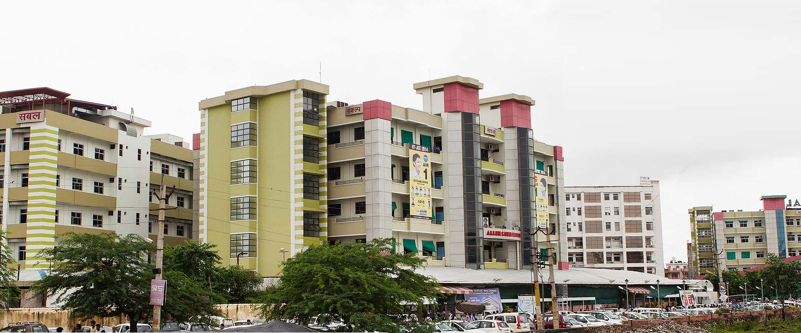
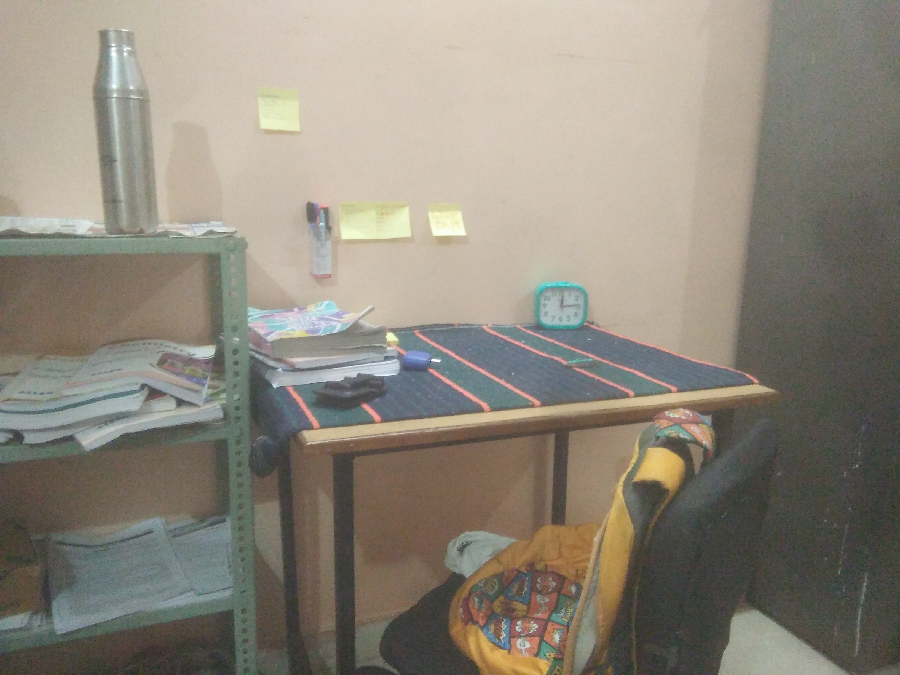
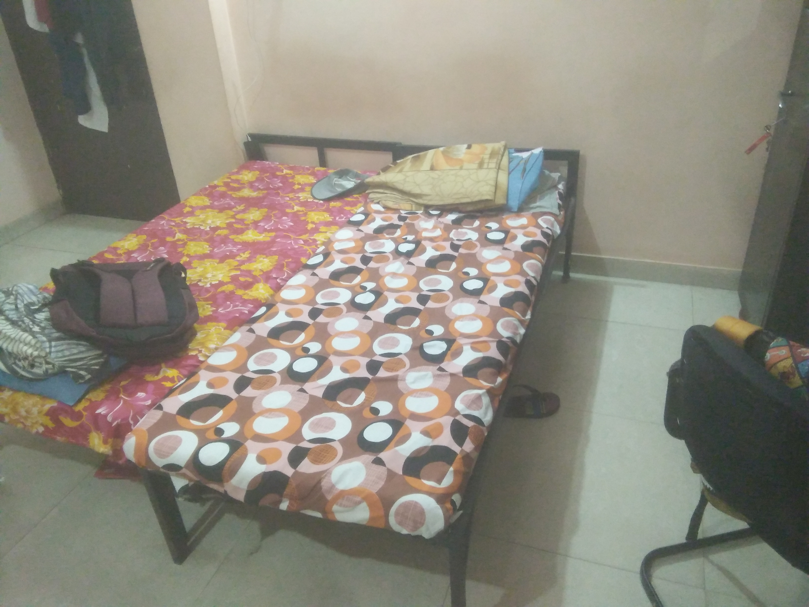
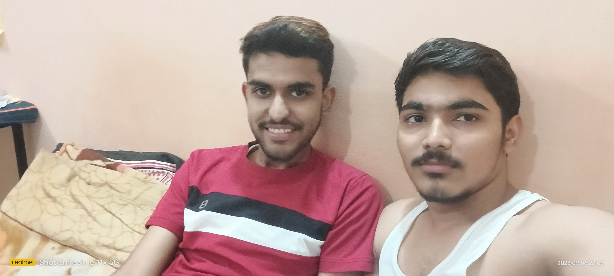

+++
author = "Siddhant Sharma"
title = "My Kota Journey: Experiences, Insights, and Stories from Kota"
date = "2024-07-31"
description = "My Kota Journey Intro and Part 1 "
categories = [
    "Personal",
    "Experiences",
    "Life"
]
tags = [
    "Kota",
    "Jee",
    "Life at Kota",
    "Kota Blog",
]
image = "mainimage.webp"
+++
<!-- SEO Meta Tags -->
<!--<title>My Kota Journey: Experiences, Insights, and Stories from Kota</title>-->
<meta name="description" content="Explore my journey in Kota as a JEE aspirant. Read about the reality of Kota, the challenges, the excitement, and the lessons learned. A must-read for students aiming for success in competitive exams.">
<meta name="keywords" content="Kota journey, JEE aspirant, Kota experiences, student life in Kota, competitive exams, coaching institutes, student stories, Kota insights, Allen Career Institute, Kota hostel life">

<!-- Open Graph Meta Tags for Social Media Sharing -->
<meta property="og:title" content="My Kota Journey: Experiences, Insights, and Stories from Kota">
<meta property="og:description" content="Explore my journey in Kota as a JEE aspirant. Read about the reality of Kota, the challenges, the excitement, and the lessons learned. A must-read for students aiming for success in competitive exams.">
<meta property="og:image" content="mainimage.webp.jpg">
<meta property="og:url" content="https://siddhant385.github.io/blog/">
<meta property="og:type" content="article">

<!-- Twitter Card Meta Tags -->
<meta name="twitter:card" content="summary_large_image">
<meta name="twitter:title" content="My Kota Journey: Experiences, Insights, and Stories from Kota">
<meta name="twitter:description" content="Explore my journey in Kota as a JEE aspirant. Read about the reality of Kota, the challenges, the excitement, and the lessons learned. A must-read for students aiming for success in competitive exams.">
<meta name="twitter:image" content="path-to-image.jpg">

### My Kota Journey

## About

This series comprises my story and experiences in Kota. This is the first part of the story.

  
  
Kota city

## Introduction

Ah, Kota! 🌟 A name that resonates with every JEE aspirant. When people think of this city, what image comes to mind? Serious students poring over books, bustling coaching centers, and an environment brimming with competition and pressure. This is what Kota means to many. 📚🏫

But is that the whole story?

### What is Reality?

The reality of Kota is quite different. It's a city like any other, filled with dreams and aspirations. Having spent almost a year here, I've seen the ground reality. Coaching institutes operate like educational business giants, teachers are treated like products, and top rankers are the showcases for prospective students. Some students are extremely serious, some are more relaxed, and I find myself somewhere in between, leaning slightly towards the chilled side. I've learned that no place is special, and no coaching can replace self-confidence and self-study. If you're serious about your studies, you can crack any exam, anywhere, whether it's online or offline. 💪📖

### Greed?

Kota is a city driven by student demand, where local shopkeepers, from small vendors to big showrooms, aim to benefit from the student population. The greed is most noticeable in areas densely populated by students. Venturing into local markets reveals significantly lower prices for the same goods. The issue lies with students who don’t bargain, allowing shopkeepers to take advantage. Everything from room rent to basic groceries, from rubber bands to soap and shampoos, is costly here. The only reasonably priced items are books, notebooks, and study materials. 📚💸

### Drugs, Suicides, and Environment?

During my time in Kota, I didn't encounter anyone involved in drugs or other illicit activities, but I did come across mobile thieves. If you talk openly in the streets with your phone, you risk losing it. The environment is decent in terms of facilities, but if you come here alone expecting to make friends and find healthy competition, think again. The competition is toxic, and everyone is focused on their own success. You’ll rarely find anyone willing to help unless you have old friends here (I was lucky to have some 😊❤️). Making new friends is tough as everyone is so engrossed in their studies, leaving no room for social life. If you get social, you risk getting distracted by the many attractions Kota offers. This intense competition and stress contribute to the alarming rate of suicides. Emotional resilience is crucial here; if you're emotionally weak, bring someone along to support you morally and physically. 🚫🧠

## A New Start

### Beginning Hostel Search and Admission

I arrived in Kota in April and enrolled at Allen Career Institute. The excitement of attending tuition classes for the first time was palpable. The city's greed was evident from the moment we arrived at the Railway Station, where auto drivers were ready to overcharge us. We fell prey to this on our first day. The auto ride took 30 minutes, dropping us at the grand Sankalp building, Allen's main office. I was awestruck by the multi-story coaching institute, resembling a castle. We went inside to secure our admission. Although our 12th-grade results were pending, the lady at the counter asked, "Are you sure you'll get more than 75% marks?" My friends, Pushpraj and Chakku, were confident, but I had doubts due to a challenging exam environment. We completed the admission process and began our hostel search. After several attempts, we found a hostel. Despite my initial reluctance, Pushpraj, his parents, and my parents saw it as ideal. I later realized they were right. Our hostel, a mix of PG and hostel, had no strict rules. We had the freedom to come and go, bring food to our rooms, and host friends. 🏨🏰

  
  
Sankalp Building src Google

### My Room

Our room was spacious, equipped with a separate washroom, AC, fan, study table, blackboard, cupboard, and beds – all in pairs for the two of us. Our parents left the same day, leaving us on our own. We began making friends and met a junior named Sameer, our neighbor. We chatted with him to get a feel of the hostel. After shopping for necessary items, we returned and rested until evening. I started wondering if Kota, notorious for suicides, had any lingering spirits in our room. Instead of feeling scared, I felt a sense of adventure. I joked to Pushpraj, "Let's beat that ghost's a**!" (As Navodayans, we had faced "ghost encounters" orchestrated by seniors trying to scare us, so we weren't easily frightened. Navodaya is another story for another time). To our amusement, there was no ghost. Suddenly, we heard someone eavesdropping at our door. It turned out to be Aryan (another neighbor) and Sameer, attempting to scare us. We told them such antics wouldn't work on us and urged them to try something bigger. We laughed, chatted, and then went for dinner. With excitement for the next day, we went to bed. 🛏️👻

**_Attaching Some Room Images from my Gallery_**

  
  
Study Table Photo from Gallery

  
  
Bed again from gallery

  
  
Me and My Friend Pussu src Mobile Gallery

### A New Day

The next day began with a mix of seriousness and curiosity. We were in a new world, unfamiliar with the coaching culture. How we navigated this new environment and what challenges we faced, I’ll share in the next part of my journey. Until then, goodbye! 🌞✨

### Images

If my any friend wants more photos please click below and personally ask me for permission as it is locked for obvious purposes.
## Conclusion

My journey in Kota has been a rollercoaster of emotions, experiences, and lessons. From initial excitement to harsh realities, it has been a path of self-discovery and growth. Remember, no place is inherently special, and no coaching institute can replace self-confidence and self-study. 🚀📚

## Feedback

I would love to hear your feedback! Please share your thoughts, suggestions, and any mistakes you noticed. Your feedback is invaluable and helps me improve. Let's make this journey interactive and engaging together! 🌟✍️

Thank you for visiting my blog! I hope you find my posts interesting and informative. Feel free to connect with me on GitHub, Instagram, or via email. Your feedback and suggestions are always welcome. Stay tuned for more updates!

<!-- Templates for adding photos -->
<!-- 

  
  
Caption for the photo

-->
