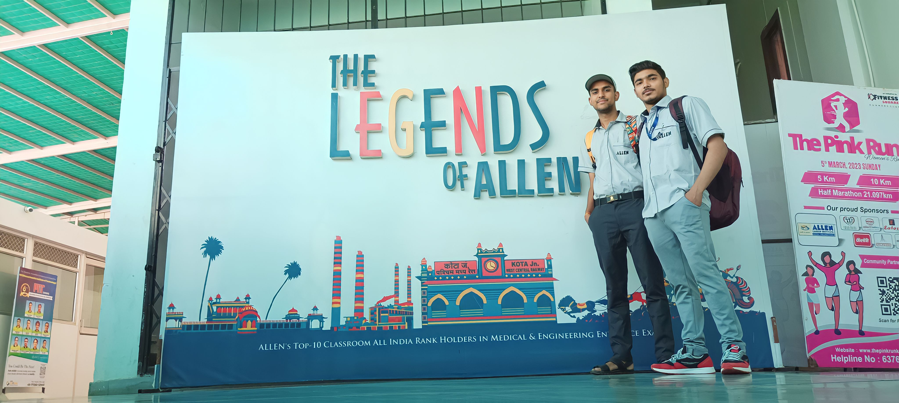

+++
author = "Siddhant Sharma"
title = "My Kota Journey: Experiences, Insights, and Stories from Kota 2"
date = "2024-08-23"
description = "A New Day"
categories = [
    "Personal",
    "Experiences",
    "Life"
]
tags = [
    "Kota",
    "Jee",
    "Life at Kota",
    "Kota Blog",
]
image = "main.webp"
+++
<!-- SEO Meta Tags -->
<!--<title>My Kota Journey: Experiences, Insights, and Stories from Kota</title>-->
<meta name="description" content="Explore my journey in Kota as a JEE aspirant. Read about the reality of Kota, the challenges, the excitement, and the lessons learned. A must-read for students aiming for success in competitive exams.">
<meta name="keywords" content="Kota journey, JEE aspirant, Kota experiences, student life in Kota, competitive exams, coaching institutes, student stories, Kota insights, Allen Career Institute, Kota hostel life">

<!-- Open Graph Meta Tags for Social Media Sharing -->
<meta property="og:title" content="My Kota Journey: Experiences, Insights, and Stories from Kota">
<meta property="og:description" content="Explore my journey in Kota as a JEE aspirant. Read about the reality of Kota, the challenges, the excitement, and the lessons learned. A must-read for students aiming for success in competitive exams.">
<meta property="og:image" content="mainimage.webp.jpg">
<meta property="og:url" content="https://siddhant385.github.io/blog/">
<meta property="og:type" content="article">

<!-- Twitter Card Meta Tags -->
<meta name="twitter:card" content="summary_large_image">
<meta name="twitter:title" content="My Kota Journey: Experiences, Insights, and Stories from Kota">
<meta name="twitter:description" content="Explore my journey in Kota as a JEE aspirant. Read about the reality of Kota, the challenges, the excitement, and the lessons learned. A must-read for students aiming for success in competitive exams.">
<meta name="twitter:image" content="path-to-image.jpg">

### A New Day

## About

This series comprises my story and experiences in Kota. This is the first part of the story.

## Introduction

Welcome to the first part of my Kota journey! This series is all about the highs, lows, and everything in between during my time as a JEE aspirant in Kota. Let’s dive into the whirlwind that was my first day in this city of dreams.

## The Start of a New Chapter 📖

The excitement of starting a new chapter kept me awake all night. With barely any sleep, I jumped out of bed, fueled by the determination to make this year count. "This is it," I thought to myself. "This is my time to shine." 🌟

After a quick brush, my roommate Pushpraj and I decided to grab breakfast. My stomach was already doing somersaults—thanks to the nerves, I guess! 🥴 Breakfast was pasta, a dish I usually love, but this time it tasted like anything but. A stomachache soon followed, but a cup of tea worked wonders. With new dreams brewing in our minds, we headed out for our first day at coaching.

## The Coaching Hunt 🏫

Kota’s coaching centers are massive—four buildings with more than 20 rooms each! 🏢 But where do we start? Our junior, Sameer, advised us to download an app called Allen Digital to check our class schedules. However, after struggling to get authorized in the app, we were left clueless and stressed. 😓

Our friend Sandarbh then suggested heading to the main office for help. We arrived early, only to find out that the person who could assist us wouldn’t be there until 11 a.m. More waiting… ⏳

## A stranger friend or foe

While waiting, I struck up a conversation with a student from Haryana. To my surprise, he was there to collect his transfer certificate—he was leaving Kota! 😲

He explained that the atmosphere in Kota was too toxic for him. He had seen students engaging in habits like smoking and chewing gutka, which made him uncomfortable. Feeling lonely and out of place, he decided to leave after just a week. His story made us question our decision to come to Kota in the first place. Was this really the right choice? 🤷‍♂️

## Coaching Allotment 

After a while, when the sir finally arrived at his office, we were called in by a kind lady. There we were—three friends: me, Pushpraj, and Chakku (aka Abhishek Chakravarti)—nervously hoping for the same coaching room assignment. 🤞

One by one, we were called inside. First up was Pushpraj. When he came back, he told us he got the TLO1BX1 coaching room with an afternoon shift. "Phew! That's not too bad," I thought. Next, it was Chakku's turn. He wished hard to be in the same room as Pushpraj, but when he came back, his face said it all—pale and disappointed. 😞 He had been assigned to the Samarth building, while Pushpraj's room was in Sankalp. The disappointment was clear; this wasn't what we hoped for.

Finally, it was my turn. 😬 I walked in, feeling the pressure. Two sirs sat next to each other and asked for my application number and attendance card. After a brief moment, they mentioned that the previous student was from the same region as me, and I nodded in acknowledgment. Then came the moment of truth—they said I got the TL01BX1 room and the second shift. WHAT?! I was stunned—how did I manage to get the exact same room as Pushpraj? 😲

Given that there were about 100,000 students at that time, and each room could accommodate a maximum of 150 students, the odds of this happening were astronomical. But somehow, it did! I walked out of that office with a big smile on my face, excitedly sharing the news with my friends. They were just as shocked and surprised as I was. How did I end up in the same room and shift as Pushpraj? Only the universe knows! 🌌

With our enrollments sorted, we were finally able to log into Allen Digital. We noticed that classes were starting at 1 PM, but it was already 12 PM. So, we all agreed to skip the first day and start fresh the next day. 🎒

**_Here is our really nice image_**

  
  
Legend Image

## Afternoon

After arriving at the hostel, we headed straight for lunch. 🍽️ Today’s treat was gobhi ke parathas, and they were absolutely delicious! 😋 I stuffed myself to the brim and then took a nap, as I was already feeling sleepy from not getting enough rest. 😴

Later, Pushpraj woke me up and told me we were heading to the temple. 🕉️

## The Temple Scence

I woke up, refreshed my face, and got ready to head out with Pushpraj. 🌟 Sameer and Aryan joined us as our guides to the temple. 🕌

On our way, I noticed why Kota is often seen as a distracting place for students. 😅 I saw a couple walking along the streets, and it seemed like some students were caught up in distractions rather than focusing on their studies. At first, I thought they were just friends, but as I observed more closely, it seemed like it was getting out of hand. 🤔

I shook off those thoughts and headed straight into the temple to seek blessings. 🙏 I asked the gods to give me strength to overcome every obstacle and succeed in my journey. 🌟✨

**_Attaching Some Temple Images from my Gallery_**

  
  
Temple images myself

  
  
Temple images Pushpraj

## Day Over

And just like that, the first day came to an end. 🌅 We enjoyed a delicious dinner, made some fascinating new friends at the hostel, and embarked on a few more adventures. 🍽️🎉

Stay tuned for this series, where I'll share more about our exciting experiences and all the fun we had! 🌟🚀

## Feedback

I would love to hear your feedback! 🌟 Please share your thoughts, suggestions, and any mistakes you might have noticed. Your input is invaluable and helps me improve. Let’s make this journey interactive and engaging together! ✍️✨

Thank you for visiting my blog! I hope you find my posts interesting and informative. Feel free to connect with me on GitHub, Instagram, or via email. 📧📸 Your feedback and suggestions are always welcome. Stay tuned for more updates and exciting content! 🚀

