+++
author = "Siddhant Sharma"
title = "Flask-Phishing"
date = "2024-07-25"
description = "Phishing and Phishing Framework Built Over Flask"
categories = [
    "Tech",
]
tags = [
    "Phishing",
    "Cyber",
    "PythonAnywhere",
]
image = "image.jpeg"
+++

# Flask-Phishing

## Introduction

Hey there, fellow tech adventurers! 🎉 Ready to dive into the sneaky world of phishing? Don't worry; this is all in good fun and education. Today, we’re going to explore a Python Flask phishing framework. Grab your virtual trench coat and magnifying glass, and let’s go!

## Phishing: The Internet's Dark Alley 🕵️‍♂️

> "Phishing is a major problem because there really is no patch for human stupidity." - Mike Danseglio 

### What on Earth is Phishing? 🤔

Imagine getting an email from your favorite pizza place offering free pizza for a year. You click the link, and boom! Your personal info is stolen. Phishing is like that—bad guys pretending to be someone you trust to steal your information. Sneaky, huh?

Phishing is a sneaky trick where bad guys pretend to be someone you know online to steal your personal info. Imagine a wolf in sheep's clothing, but the sheep is your favorite website. The site looks legit but is made to trick you. Always check twice before entering your info!


### So, Why Should I Care? 🤷‍♀️

Knowing about phishing is crucial because it shows just how easy it is to fall for these tricks. But here’s the twist: we’re going to use this knowledge for good. I’ll show you how to set up a phishing site (purely for educational purposes, of course).

**Disclaimer**: This tool is for ethical hackers only. If you're not one of those, please go back to watching cat videos. 😸 We’re not responsible if you turn into a cyber villain. Use at your own risk, and remember, your mom was right about talking to strangers online. 🚫

### What Makes This Tool Special? 🎉

- **Flask-Powered**: Deploy it on the web with ease.
- **No Port Forwarding**: Forget the hassle of port forwarding or ngrok.
- **User-Friendly**: Simple web interface that even your grandma could use (probably).
- **Accessible**: Just need the internet and a web browser.


## Installation on Webhosting 🌐

1. Requirements: Internet and a device (laptop recommended, but you can try your luck with a mobile phone).
2. Deployment Platform: We'll use PythonAnywhere.

## Step-by-Step Guide 🚀

1. **Create an Account**: Sign up on PythonAnywhere. Yes, you know how to create an account. 🙄

2. **Dashboard Navigation**: Head to the dashboard.

3. **Open a New Console**: Click on 'New Console' and select 'Bash'.

4. **Clone the Repository**: Enter `git clone https://github.com/siddhant385/flask-phishing` in the console.

5. **Navigate to Directory**: Type `cd flask-phishing` in the console

6. **Install Requirements**: Run `pip install -r requirements.txt.`

7. **Open Web Tab**: Go back to the dashboard and click on 'Web'.

<div style="text-align: center;">
  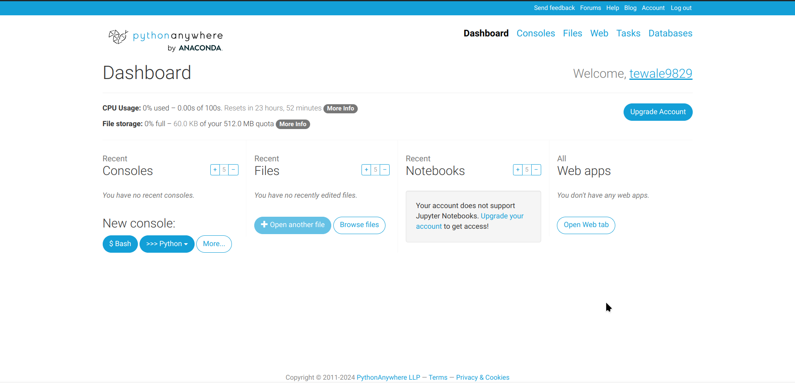
</div>

8. **Add New Web App**: Click on 'Add new web app' and select 'Flask'

<div style="text-align: center;">
  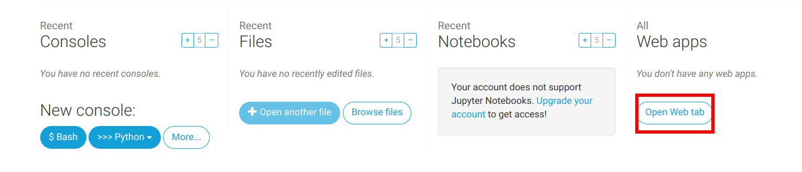
</div>

- Next Step

<div style="text-align: center;">
  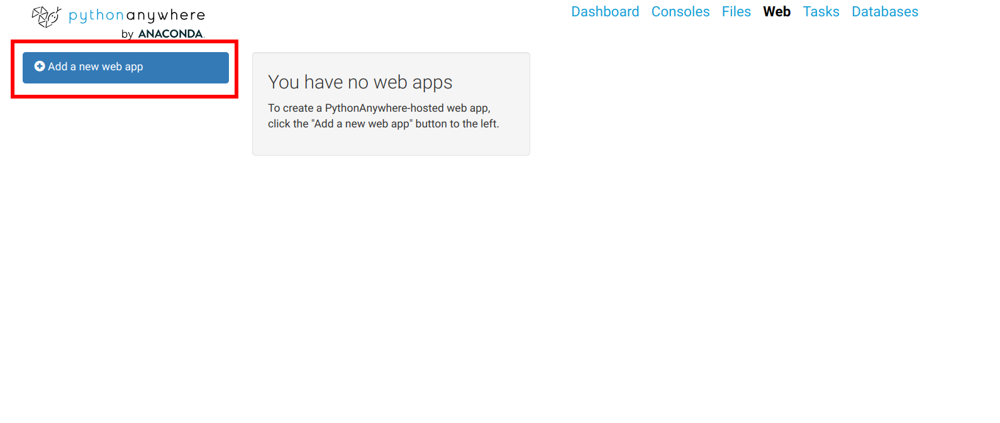
</div>

- Next Step

<div style="text-align: center;">
  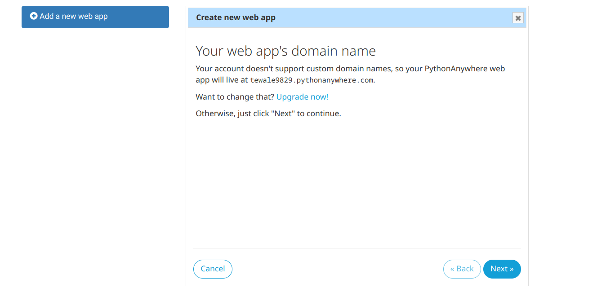
</div>

- Next Step

<div style="text-align: center;">
  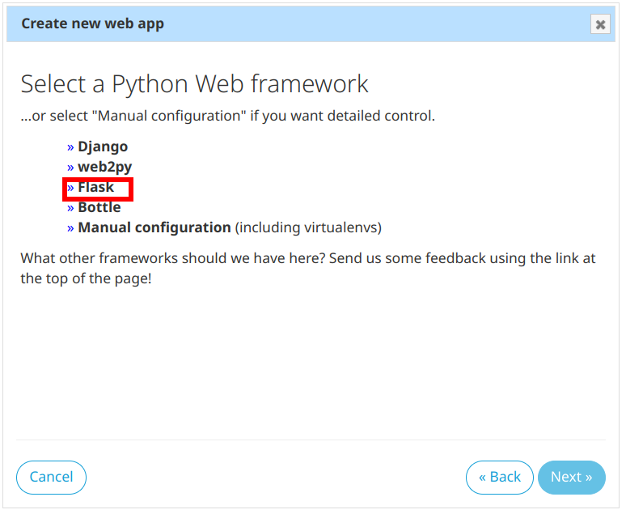
</div>


  <!-- Add more images as needed -->


 <!-- 2.png -->

<!-- 3.png -->

<!-- 4.png -->

<!-- 5.png -->

9. **Configure Path**: Enter the path to your main script, e.g., **/home/yourusername/flask-phishing/main.py.**

<div style="text-align: center;">
  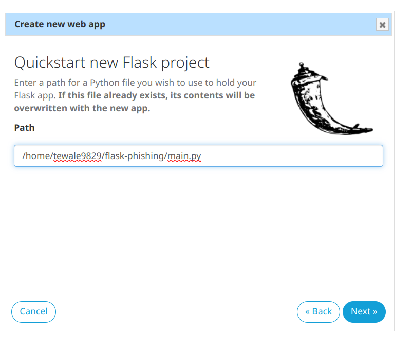
</div>

10. After you have clicked next a web dashboard will be opened scroll down and then click go to directory of Source code as given in picture below

<div style="text-align: center;">
  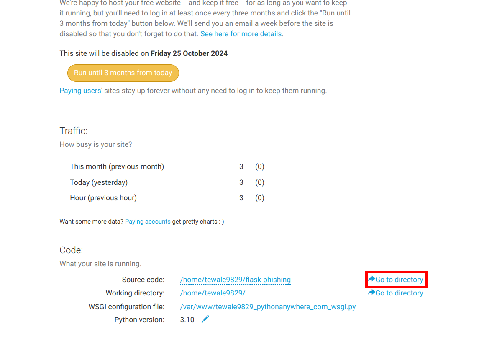
</div>

11. Now click on main.py

<div style="text-align: center;">
  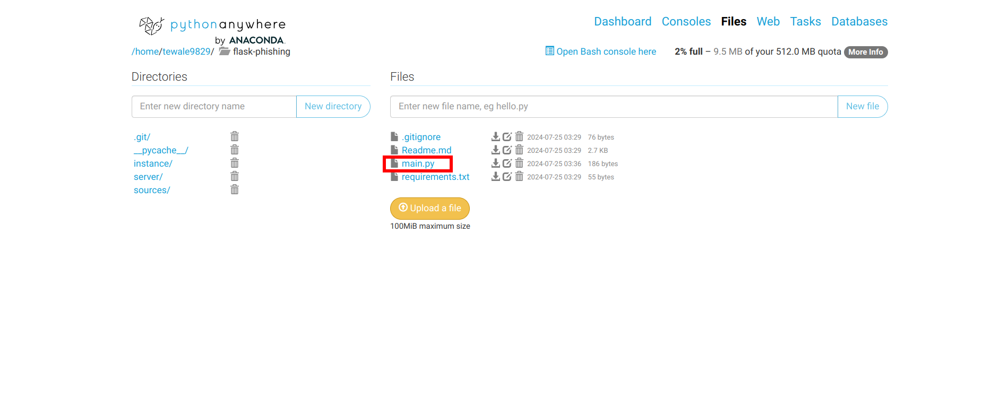
</div>

12. Open a new tab and open this [url](https://github.com/siddhant385/flask-phishing/blob/main/main.py) on your new tab and click copy button as shown in the picture 
Url is : https://github.com/siddhant385/flask-phishing/blob/main/main.py

<div style="text-align: center;">
  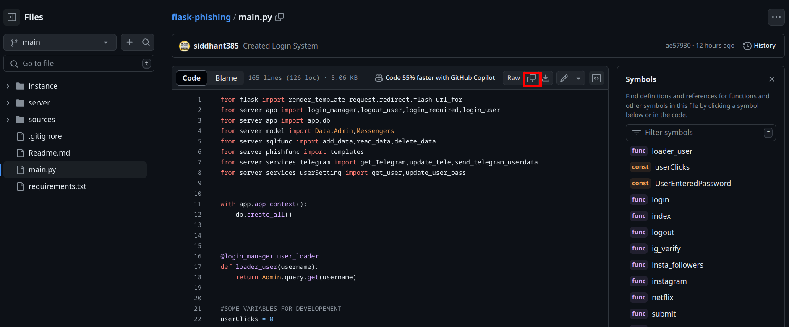
</div>

13. After you have copied the code remove all the previous code written in the main.py and paste copied code there and click on save button

<div style="text-align: center;">
  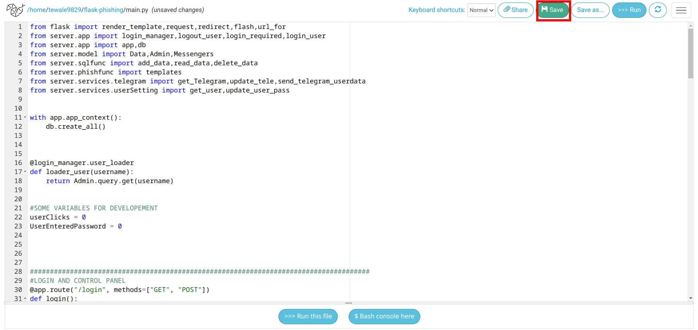
</div>

14. **Reload Your Site**: Click on 'Reload' on the PythonAnywhere dashboard.

<div style="text-align: center;">
  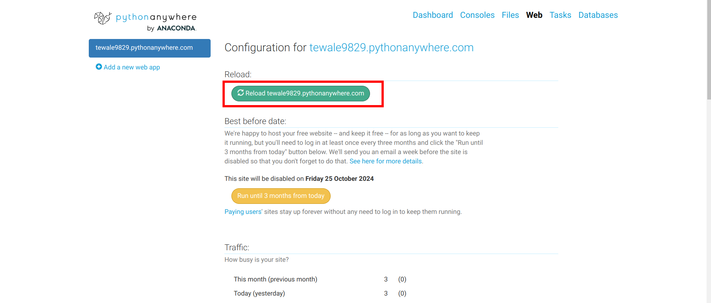
</div>

15. **Access Your Site**: Go to yourusername.pythonanywhere.com. Use default credentials **admin** and **root** to log in, then change them immediately.

<div style="text-align: center;">
  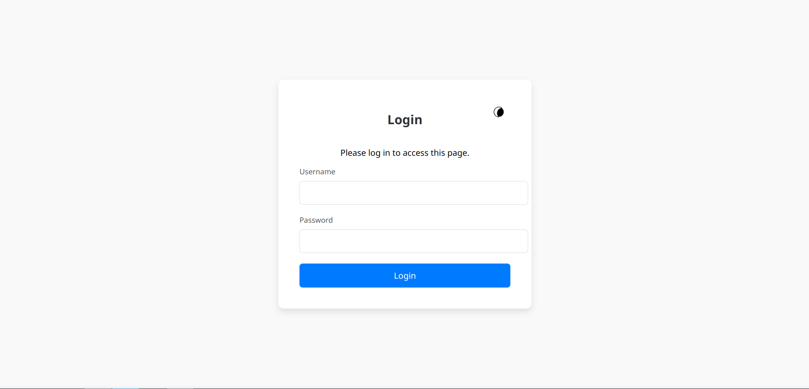
</div>
- You will be redirected to a new page click on config tab and change your username and password. Hence you are good to go

### Congrats! 🎉
You have successfully hosted your phishing site!

 


## Aftermath🎭

- Create a Telegram Bot: Send usernames and passwords directly to your Telegram bot.
- Send Links: Share links to teach others about phishing.
- View Trapped Data: Check the DATA tab for captured info.
- Contribute: Help improve the tool.
- Star the Repo: Show your support for the author! 🌟


## Prevention Tips 🚨

- Avoid unexpected links or attachments.
- Hover over links to check URLs.
- Enable 2FA for extra security.
- Keep your system, browser, and antivirus updated

## Conclusion

So, there you have it, the lowdown on phishing. It's like those annoying telemarketers but way sneakier. Be smart, stay alert, and don't click on everything you see. If it sounds too good to be true, it probably is. When in doubt, ask a friend, parent, or teacher.

Remember, your online life is like your room: keep the doors locked and don't let just anyone in. 🛡️

Write your thoughts in the comments below!

Thank you for visiting my blog! I hope you find my posts interesting and informative. Feel free to connect with me on GitHub, Instagram, or via email. Your feedback and suggestions are always welcome. Stay tuned for more updates!

<div style="display: flex; gap: 10px;">
<a href="https://www.github.com/siddhant385" target="_blank">
  
</a>
<a href="https://www.instagram.com/s.i.d385" target="_blank">
  
</a>
<a href="mailto:your-email@example.com">
  
</a>
<a href="https://some.tm.me" target="_blank">
  
</a>
</div>
```


